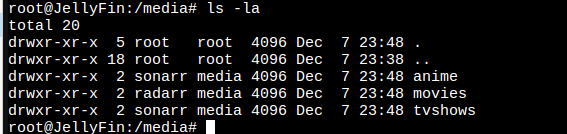

> DISCLAIMER: This article serves educational purposes only.
{: .prompt-tip }


 Requirements

- Basic Linux knowledge
- A Linux server (I recommend at least 4GB of RAM, but it works with 2GB)
    - I am going to use a Debian 12 buster.
- Enough storage to store your media

# Media Stack
----
- **Jellyfin** - streams media from the server to different clients.
- **Sonarr** - manages TV shows (and anime) and sends requests to Jackett.
- **Radarr** - manages movies and sends requests to Jackett.
- **Jackett** - parses results coming from Radarr and Sonarr and finds available torrents for such media.
    - We can use prowlarr instead of jackett, but I didn't find much about indexers in other languages.
- **Transmission** - torrent client to download media.
    - We can use any other torrent client like qBittorrent, etc...
- **Jellyseerr** - webapp for users to discover and request movies and TV shows.
- **Bazarr** - scans available media and downloads subtitles for it.


- Build on docker: [Guide](https://zerodya.net/self-host-jellyfin-media-streaming-stack/)

# Installations
---
Oficial Documentations:
- [JellyFin](https://jellyfin.org/docs/general/installation/)
- [Bazarr](https://wiki.bazarr.media/Getting-Started/Installation/Linux/linux/)
- [Radarr](https://wiki.servarr.com/radarr/installation/linux)
- [Sonarr](https://sonarr.tv/#downloads-v3-linux)
- [JellySeer](https://github.com/Fallenbagel/jellyseerr)
## JellyFin
---
- Ejecutamos en un terminal
```bash
curl https://repo.jellyfin.org/install-debuntu.sh | sudo bash
```
- Once installed we will have access via web ([http://ip-machine:8096](http://ip-machine:8096))

- Create an account


- We are going to configure the paths where jellyfin will take the movies, series, etc... we need to create them in the O.S. and then we follow jellyfin's steps.
```bash
mkdir /media/movies
mkdir /media/anime
mkdir /media/tvshows
```


- I create 3 librarias ( movies, anime, shows )


- Set our preferred metadata Language


- Si queremos acceder desde otra red, seleccionamos " allow remote...",  si lo vamos a ver desde localhost, la deseleccionamos.


And.., that´s done!


Now, you can select your jellyfIn server, and login it.


## Transmission
---

- En terminal ejecutamos:
```bash
sudo apt install transmission-cli transmission-daemon
sudo systemctl restart transmission-daemon
sudo systemctl enable transmission-daemon
```

- Con esto, ya tendremos disponible transmissión en el panel web [http://ip-maquina:9091/](http://ip-maquina:9091/) pero antes necesitamos configurar un par de cosas:
	- Paramos el servicio:
	```bash
	sudo systemctl stop transmission-daemon
	```
	- Editamos el archivo de configuración

```bash 
sudo nano /etc/transmission-daemon/settings.json
```

- Añadir redes a la whitelist, en mi caso:


- Cambiar usuario y su contraseña por maior seguridad:


- Levantamos el servicio de nuevo, nos aparecerá un alert para iniciar sesión.
```bash
sudo systemctl start transmission-daemon
```


## Bazarr
---
- Instalamos los requisitos
```bash
sudo apt-get install python3-dev python3-pip python3-distutils unrar unzip
```
- En Debian, el paquete "unrar" se encuentra en el repositorio "non-free". Puedes habilitar este repositorio y luego instalar "unrar" con el siguiente procedimiento:
```bash
sudo nano /etc/apt/sources.list 
```
- Asegúrate de que tu archivo `sources.list` incluya "non-free" al final de las líneas de repositorio. Por ejemplo:
```bash
deb http://deb.debian.org/debian/ buster main contrib non-free  
deb-src http://deb.debian.org/debian/ buster main contrib non-free
```

- Actualizamos e instalamos 
```bash
sudo apt update  
```

- Antes de copiar y pegar, revisad que la release 1.4.0 sea la última:

```bash
wget https://github.com/morpheus65535/bazarr/releases/download/v1.4.0/bazarr.zip
sudo mkdir /opt/bazarr
sudo unzip bazarr.zip -d /opt/bazarr
cd /opt/bazarr
```

[TODO ]

## Jackett
----

```bash
adduser jackett

cd /opt && f=Jackett.Binaries.LinuxAMDx64.tar.gz && release=$(wget -q https://github.com/Jackett/Jackett/releases/latest -O - | grep "title>Release" | cut -d " " -f 4) && sudo wget -Nc https://github.com/Jackett/Jackett/releases/download/$release/"$f" && sudo tar -xzf "$f" && sudo rm -f "$f" && cd Jackett*

chown jackett:jackett -R "/opt/Jackett"

sudo ./install_service_systemd.sh && systemctl status jackett.service && cd - && echo -e "\nVisit http://127.0.0.1:9117"
```

- Con esto podremos ver en nuestro navegador desde [http://ip-machine:9117](http://ip-machine:9117)


Añade tantos indexadores como quieras:


## Radarr
----

```bash
sudo groupadd media && sudo adduser radarr --ingroup media
```

- Instalamos requisitos

```bash
sudo apt install curl sqlite3
```

- Download the correct binaries for your architecture.
	- You can determine your architecture with
	-  ```dpkg --print-architecture ```
		-  AMD64 use `arch=x64`
		- ARM, armf, and armh use `arch=arm`
		- ARM64 use `arch=arm64`

```bash
wget --content-disposition 'http://radarr.servarr.com/v1/update/master/updatefile?os=linux&runtime=netcore&arch=x64'
```

- Uncompress the files:
```bash
tar -xvzf Radarr*.linux*.tar.gz
```

- Move the files to `/opt/`

```bash
sudo mv Radarr /opt/
```

- Ensure ownership of the binary directory.

```bash 
sudo chown radarr:media -R /opt/Radarr
```

- Configure systemd so Radarr can autostart at boot.

```bash
cat << EOF | sudo tee /etc/systemd/system/radarr.service > /dev/null
[Unit]
Description=Radarr Daemon
After=syslog.target network.target
[Service]
User=radarr
Group=media
Type=simple

ExecStart=/opt/Radarr/Radarr -nobrowser -data=/var/lib/radarr/
TimeoutStopSec=20
KillMode=process
Restart=on-failure
[Install]
WantedBy=multi-user.target
EOF
```

> Nos aseguramos que /var/lib/radarr, exista y el usuario radarr tenga permisos dentro, si no es así lo creamos a mano con mkdir y chwon.

- Reload systemd

```bash
sudo systemctl -q daemon-reload
```

- Enable the radarr Service

```bash
sudo systemctl enable --now -q radarr
```

- [Optional] Remove the .tar:

```bash
	rm Radarr*.linux*.tar.gz
```

Browse to `http://ip-machine:7878` to start using Radarr.


- If Radarr did not appear to start, then check the status of the service:
```shell
sudo journalctl --since today -u radarr
```

## Sonarr
----

```bash
sudo apt-key adv --keyserver hkp://keyserver.ubuntu.com:80 --recv-keys 2009837CBFFD68F45BC180471F4F90DE2A9B4BF8

echo "deb https://apt.sonarr.tv/debian buster main" | sudo tee /etc/apt/sources.list.d/sonarr.list

sudo apt update
```

>During the installation, you will be asked which user and group Sonarr must run as. It's important to choose these correctly to avoid permission issues with your media files. We suggest you keep at least the group name identical between your download client(s) and Sonarr. If you need to correct these after installation, please run `dpkg-reconfigure sonarr`. See [debconf](https://wiki.debian.org/debconf) for more information.

```bash
sudo apt install sonarr
```


Browse to `http://ip-machine:8989` to start using Sonarr.


## JellySeer
----
```bash
sudo apt install -y curl dirmngr apt-transport-https lsb-release ca-certificates

# Agrega la clave GPG del repositorio oficial de Node.js
curl -sL https://deb.nodesource.com/gpgkey/nodesource.gpg.key | sudo gpg --dearmor -o /usr/share/keyrings/nodesource-archive-keyring.gpg

# Configura el repositorio de Node.js LTS
echo "deb [signed-by=/usr/share/keyrings/nodesource-archive-keyring.gpg] https://deb.nodesource.com/node $(lsb_release -s -c) main" | sudo tee /etc/apt/sources.list.d/nodesource.list

# Actualiza la base de datos de paquetes nuevamente
sudo apt update

# Instala Node.js LTS
sudo apt install -y nodejs npm

npm install -g yarn
```

- Install dependencies and build it
```bash
git clone https://github.com/Fallenbagel/jellyseerr.git && cd jellyseerr
git checkout main #if you want to run stable instead of develop
yarn install
yarn run build
yarn start
```

- - assuming jellyseerr was cloned to `/opt/` and the environmentfile is located at `/etc/jellyseerr`
- 
	- Service:
	```bash
cat << EOF | sudo tee /etc/systemd/system/jellyseerr.service > /dev/null

[Unit]

Description=Jellyseerr Service

Wants=network-online.target

After=network-online.target

​

[Service]

EnvironmentFile=/etc/jellyseerr/jellyseerr.conf

Environment=NODE_ENV=production

Type=exec

Restart=on-failure

WorkingDirectory=/opt/jellyseerr

ExecStart=/usr/bin/node dist/index.js

​

[Install]

WantedBy=multi-user.target

EOF
```

- Environmentfile

```bash
mkdir /etc/jellyseerr
```

```bash
cat << EOF | sudo tee /etc/jellyseerr/jellyseerr.conf > /dev/null
# Jellyseerr's default port is 5055, if you want to use both, change this.
# specify on which port to listen
PORT=5055

# specify on which interface to listen, by default jellyseerr listens on all interfaces
#HOST=127.0.0.1

# Uncomment if your media server is emby instead of jellyfin.
# JELLYFIN_TYPE=emby
EOF
```

```bash
sudo systemctl -q daemon-reload
sudo systemctl enable --now -q jellyseerr
```
Browse to `http://ip-machine:5055 to start using Radarr.


If you get some error:

```bash
sudo journalctl --since today -u jellyseerr
```

# Configurations
---
## Sonarr & Radarr
---

> Radarr is a fork of Sonarr so they are both very similar.

Radarr neeed an authentication...


### Add download client

>Go to Settings > Download Clients and click on the big [+] button.
	In the next section choose Transmission and configure it like this.
	Click Test and if successful, save.


> Username and password are the same that we use to login on transmision popup, if you don´t set any, you are using default credentials see on:
>  `/etc/transmission-daemon/settings.json

### Add indexers

>Go to Settings > Indexers and click on the big [+] button. In the next section
   choose Torznab.
   Go to Jackett and copy-paste both the Jackett API key and the Indexer Torznab feed URL.


 


> Algunos indexadores darán error, esto puede ser pq el torrent que estámos indexando está caido, no es para pelis ( si estamos en radarr) o no es para series (si estamos en sonarr)

Añade tantos indexadores como guste.


### Add directories

> Go to Settings > Media Management and click on the blue Add Root
	Folder button. Add /anime and /tvshows for Sonarr, and /movies for Radarr.

```shell
$ sudo chown -R sonarr:media /media/anime
$ sudo chown -R sonarr:media /media/tvshows/
$ sudo chown -R radarr:media /media/movies/
```



### Create new profils

> Esto es para pode decargar contenido en español, con la calidad que nosotros marquemos.
> Lo podemos ver en Settings > Profiles


## JellySeer
### Create account using jellyfin


### Configure media server


### Configure Services


We wiil need the api key ( Settings > General )


And thas all...


Podemos ver como se descarga desde:

- Transmission:


- Radarr:


- JellySeer:


