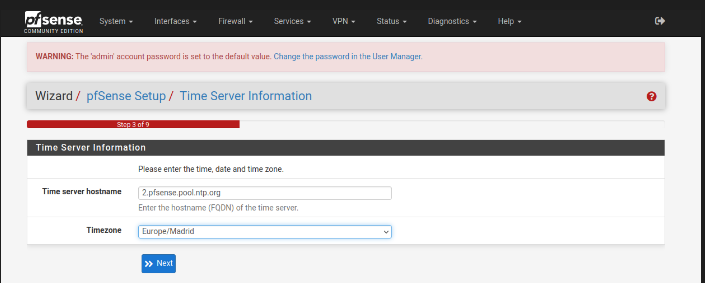

---

# Schema


# Install PfSense

## Create VM on proxmox

> Creation virtual machine


> vmbr0 is my wan interface, in other words, my network company


## Attach another networks interfaces

>We need to attach another network interface on proxmox ( our S.O)

I create a network interface with ipv4 -> 11.11.11.11/24, thats the ip address that we access to pfsense.


And add to pfsense machine:


## Pfsense installer 

- Accept copyrigth


- Set install pfSense


- Select default config


- If we have a raid on our system we select that, on my case i set "Stripe - No Redundancy"


- If we have more than one disk, we need to select where we are going to install all. 

> Select once with "space" key


- Now its time to take some coffe, we probably see somthing like:


- Once it ends, we are going to reboot the system.
  
## Config LAN 


On console pfsnse assign automatically ip addreess for a LAN, we are going to set a ip adress.


>By default all administration is via LAN so we need Enabling Administration via the WAN Interface
> 
>Choose option 8 (Shell) and type **pfctl -d**
>
>This will disable the packet filter entirely and you will be able to access the web interface from any interfaces. Useful for temporary or first time setup.
>
>To enable it back, just type **pfctl -e**


## WIZARD Config


> Default credentials: username: admin // paswd: pfsense

- Now, we need to configure the pfsense.




- On confgure WAN, i set all by default configuration, only i unheck this:


- Set a new paswd for admin.


> If we are connected for wan interface, we need to execute again "pfctl -d" on shell.

And we finish the setUp of pfSense!

> To know that we have everything well configured, if we add a router as an access point to the LAN, or create virtual machines with the vmbr1 (LAN) card, we will see how the traffic flows:


## Config DMZ 

### Proxmos details

- At Proxmox we need to modify the networks

A litle spoiler:


Install openvswitch-switch on proxmox

```bash
$ apt install openvswitch-switch
```
- Create > OVS Bridge


- Create > OVS inPort


 > We can create as many vlans as we want, always associated to vmbr3 in this case.

- We apply the changes, and add this new interface to pfSense.(hardware > Add > network device)


### PfSense configuration dmz-pfsense

- Create a vlan


>The vlan tag has to be the same as the one we associated in the proxmox, vtnet2 is the new interface we added to pfSense.

- Add new interface to pfsense (vlanDMZ)


- We activate it and configure it as static ipv4


- Activate the dhcp of this vlan and save (optional, add a range of ips).


### Firewall DMZ

> Firewall > rules

This is very personal because it depends on what rules you want to have, what data flow you want to allow, etc....

In first instance a very basic dmz would be like this: 

- 1º All traffic accepted


- 2º Block access from the dmz to the LAN


- 3º We block the passage from the dmz to the wan.
  


- In the end we will have something like this: 


- This is an example of how it could get complicated, feel free to try it out and configure it, stay safe


> Now to add machines or create them inside the DMZ we only need the bridge and the tag of our vlan, in this case we only have one vlan which is for the dmz, but we can have several, one for work area, another one for guests, etc...


> With this you would already have your wifi network separated in WAN/LAN/DMZ 
{: .prompt-tip }


🚀 Don’t forget to check out the 🚀 [DNS & AdBlock](/posts/adblock-configuration/) to improve your PfSense setup.

