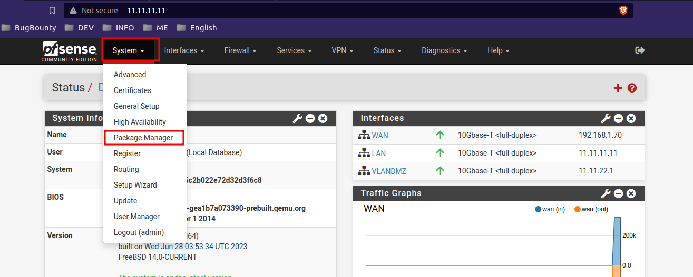

This configuration is part of [Pfsense-WAN-LAN-DMZ](/posts/network-configuration/), if you want to take a look at it.

---

As now our wifi network is over the LAN, we have control over the packets that are sent and received, that's why we can change the dns and use our own ones like pi-hole, adguard, etc... so that we can filter contents, ads, certain pages, etc...


# AdBlocks 

Como ahora nuestra red wifi está sobre la LAN, tenemos control sobre los paquetes que se envian y se reciben, es por eso que podemos cambiar los dns y usar unos propios como pi-hole, adguard, etc... de tal forma que podremos filtrar contenidos, anuncions, determinadas pág, etc...

## Pi-hole
 ### Instalation
 ``` bash
 curl -sSL https://install.pi-hole.net | bash
 ```

 ### Basic config
 - Change passwd
 ``` bash
 pihole -a -p
 ```

- Podremos acceder a la interfaz web, http://{your-ip}/admin

 Si iniciamos sesión veremos algo similar a: 


Una vez tengamos esto, podremos configurar sus reglas.


> Aquí añadiremos todo los servicios de DNS que tengamos, en este caso el Adguard ( lo instalaremos más adelante, y el pfsense en su defecto.)

En Ajustes:

- DNS


El resto lo dejaremos por defecto.
## Adguard

### Installation

``` bash
$ curl -LO https://github.com/AdguardTeam/AdGuardHome/releases/latest/download/AdGuardHome_linux_amd64.tar.gz

$ tar -vxf AdGuardHome_linux_amd64.tar.gz

$ sudo mkdir /opt/AdGuardHome
$ sudo mv ~/AdGuardHome/AdGuardHome /opt/AdGuardHome/

$ sudo chown -R root:root /opt/AdGuardHome
$ sudo chmod -R o-rwx /opt/AdGuardHome

$ sudo /opt/AdGuardHome/AdGuardHome -s install

```

>If you are using a firewall like **ufw** (and you really should be), you might need to temporarily open ports to make sure you can reach the server from the outside. This would look like:
> ` sudo ufw allow 3000/tcp`

La configuración dependerá un poco de nuestra red, en este caso mi configuració del wizard era por defecto, pero fijarse bien en que red va escuchar en este caso será la LAN ( única interfaz de red que tiene la máquina)

### Basic config


Aquí añadiremos las blockilist según nos convenga


## BINDNS

Una vez tenemos nuestros servidores DNS configurados, es hora de decirlo al pfsense como va a ser su gestión en la red LAN ( donde nos conectaremos normalmente)

### Installation


Yo ya lo tengo instalado, pero en "Available Packages", buscar por Bind y aparecerá este, le dais a instalar y os aparecerá después en "installed packages":


#### Posibles errores
Es común que en función de la configuración, isntalación, etc.. esto falle y de un erro similar a:


En este caso, abrimos una shelle en pfsense y actualizamos los repos:


```bash
pkg update -f ; pkg upgrade -fy; pkg-static clean -ay; pkg bootstrap -fy; pkg-static install -fy pkg pfSense-repo pfSense-upgrade; pkg-static upgrade -fy; pfSense-upgrade fy;
```

Reiniciamos el sistema y deberíamos tener este error arreglado.

```bash
 reboot
```

## Configuration

Esto nos creará un nuevo servicio:


Copiamos configuración:


Creamos una vista nueva:


Creamos una zona nueva.


> En "Zone Domain record", añadimos los dominios que nos interesen, si no tenemos ninguno para añadir, añadimos el pfsense, ya que minimo necesita 1.

guardamos los cambios y listo.

Antes de validar que todo funcione, nos aseguramos que pfsense use los dns que queremos, para eso:


> En la instalación añadí "saf.local", ".local" está reservado por lo que no podremos usarlo en este caso.

!Nos funciona!

