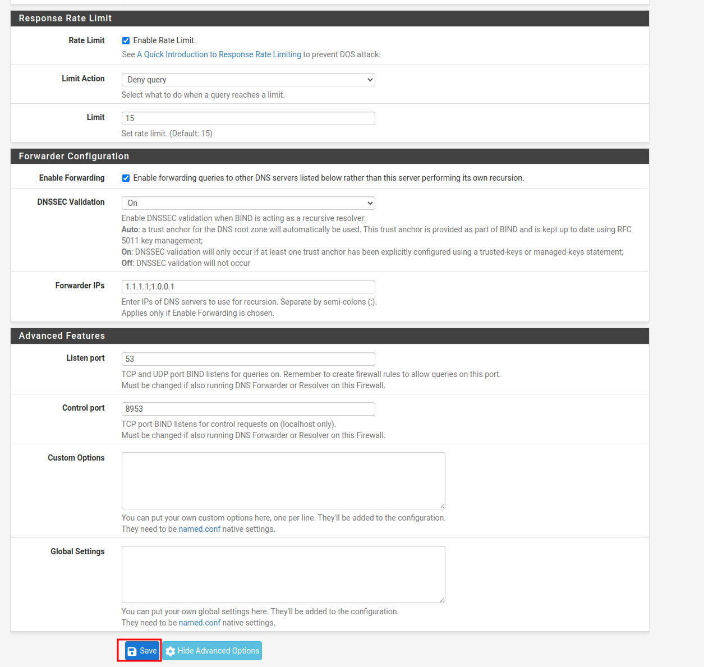
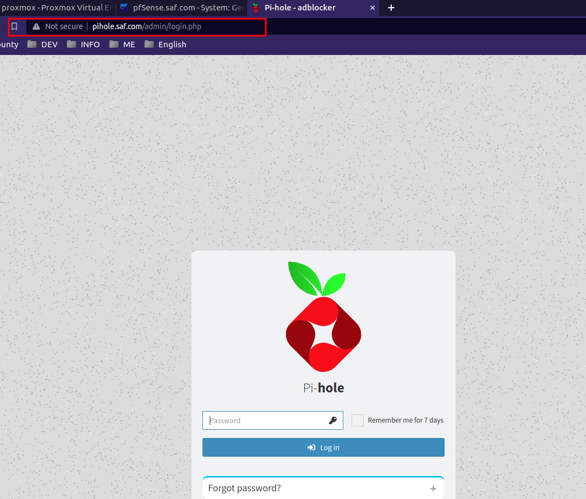

This configuration is part of [Pfsense-WAN-LAN-DMZ](/posts/network-configuration/), if you want to take a look at it.

---

>In the following post, we are going to look at how to configure our dns servers and filter the ads creating an adblock per network.
{: .prompt-info }

# AdBlocks 

As now our wifi network is over the LAN, we have control over the packets that are sent and received, that's why we can change the dns and use our own ones like pi-hole, adguard, etc... so that we can filter contents, ads, certain pages, etc...

## Pi-hole
### Instalation
 ``` bash
 curl -sSL https://install.pi-hole.net | bash
 ```

### Basic config
 - Change passwd
 ``` bash
 pihole -a -p
 ```

- We will be able to access the web interface, http://{your-ip}/admin

- If we log in we will see something similar to:


- Once we have this, we can configure your rules.


> Here we will add all the DNS services that we have, in this case the Adguard (we will install it later, and pfsense in its absence).

In Settings:

- DNS


The rest will be left as default.
## Adguard

### Installation

``` bash
$ curl -LO https://github.com/AdguardTeam/AdGuardHome/releases/latest/download/AdGuardHome_linux_amd64.tar.gz

$ tar -vxf AdGuardHome_linux_amd64.tar.gz

$ sudo mkdir /opt/AdGuardHome
$ sudo mv ~/AdGuardHome/AdGuardHome /opt/AdGuardHome/

$ sudo chown -R root:root /opt/AdGuardHome
$ sudo chmod -R o-rwx /opt/AdGuardHome

$ sudo /opt/AdGuardHome/AdGuardHome -s install

```

>If you are using a firewall like **ufw** (and you really should be), you might need to temporarily open ports to make sure you can reach the server from the outside. This would look like:
> ` sudo ufw allow 3000/tcp`

The configuration will depend a little on our network, in this case my wizard configuration was by default, but pay attention to the network you are going to listen in this case it will be the LAN (the only network interface that the machine has).

### Basic config


Here we will add the blockilist as we see fit.


## BINDNS

Once we have our DNS servers configured, it is time to tell pfsense how it is going to be managed on the LAN (where we will normally connect)

### Installation


I already have it installed, but in "Available Packages", search for Bind and this will appear, click on install and it will appear later in "installed packages":


#### Potential errors
It is common that depending on the configuration, installation, etc.. this fails and gives an error similar to:


In this case, we open a shelle in pfsense and update the repos:


```bash
pkg update -f ; pkg upgrade -fy; pkg-static clean -ay; pkg bootstrap -fy; pkg-static install -fy pkg pfSense-repo pfSense-upgrade; pkg-static upgrade -fy; pfSense-upgrade fy;
```

Reboot the system and you should have this error fixed.

```bash
 reboot
```

## Configuration

This will create a new service:


Copy configuration:




We create a new view:


We create a new area:


> En “Zone Domain record”, añadimos los dominios que nos interesen, si no tenemos ninguno para añadir, añadimos el pfsense, ya que minimo necesita 1.

- Save the changes and that's it.

Before validating that everything works, we make sure that pfsense uses the dns we want, for that:


> En la instalación añadí "saf.local", ".local" está reservado por lo que no podremos usarlo en este caso.


Before proceeding make sure you have a static IP address assigned to the Pi Hole server.

Update this on the pfsense: 

- Allow DHCP/PPP on the WAN to override the DNS server list.
- Do not utilize the DNS Forwarder/DNS Resolver as the firewall’s DNS server.


- Enable DNS resolver
- Enable DNSSEC Support
- And activate the Forwarding Mode


It works for us!



- Pihole dasboard:


- Adguard dashboard:


