# A viaxe

> Una experiencia de sabores por el mundo

> Alexis deberias cambiar de cohe.
{: .prompt-info }

## INTRO

> Primer plano nada más sentarse
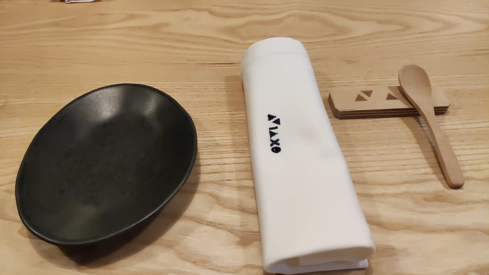

## 1º Tentempie

> Con esto el chef quería impresionar antes de empezar

> Especie de mousse muy suave de pescado, espinacas, citrico, sal...
{: .prompt-tip }

Puntuacion guía ANDRADE FS: **9/10**
- Sabor en boca: 9/10
- Textura: 10/10 
- Regusto: 9/10
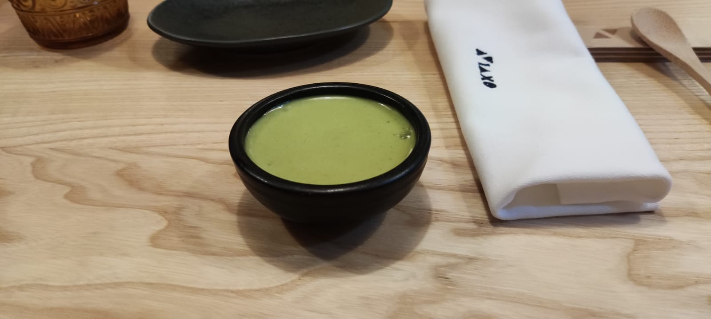

# Salado

## 1º Plato

> Esto fue una hostia pero sabrosa, repetiria 100%

> Japón: Especie de tartar de tapioca con ajo, maiz ( con el sabor restante de cocinar todo eso)
{: .prompt-tip }

Puntuacion guía ANDRADE FS: **11/10**
- Sabor en boca: 10/10
- Textura: 10/10 
- Regusto: 10/10
- BONUS: 1/1
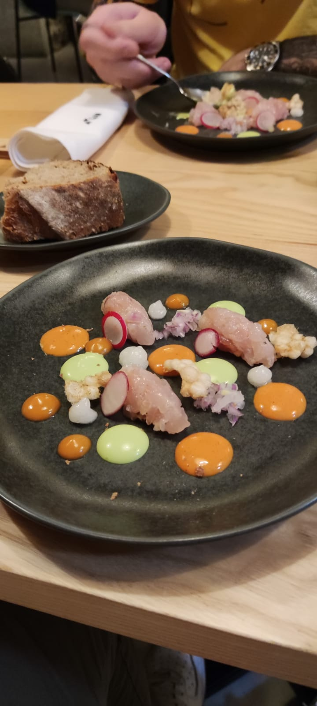

## 2º Plato

> Podriamos comer 4kilos desto sin despeinarnos

> Perú: Mezcla de cebiche con un plato tipico de comida callejera.
{: .prompt-tip }

Puntuacion guía ANDRADE FS: **10/10**
- Sabor en boca: 9/10
- Textura: 10/10 
- Regusto: 9/10
- BONUS: 1/1
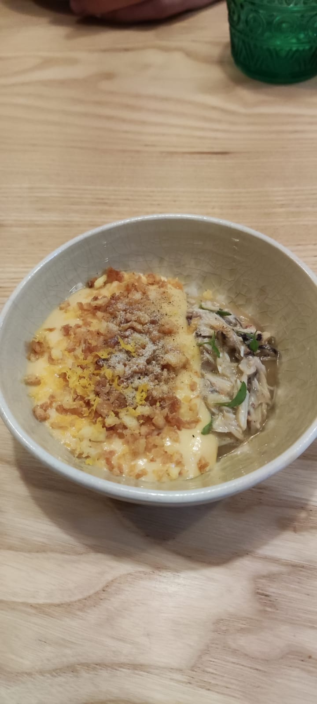

## 3º Plato

> Explosión de sabor, la joya de la corona.

> Mediterraneo???  Huevas de trucha, con una espuma de ??, estaba buenisimo
{: .prompt-tip }

Puntuacion guía ANDRADE FS: **11/10**
- Sabor en boca: 10/10
- Textura: 10/10 
- Regusto: 10/10
- BONUS: 1/1
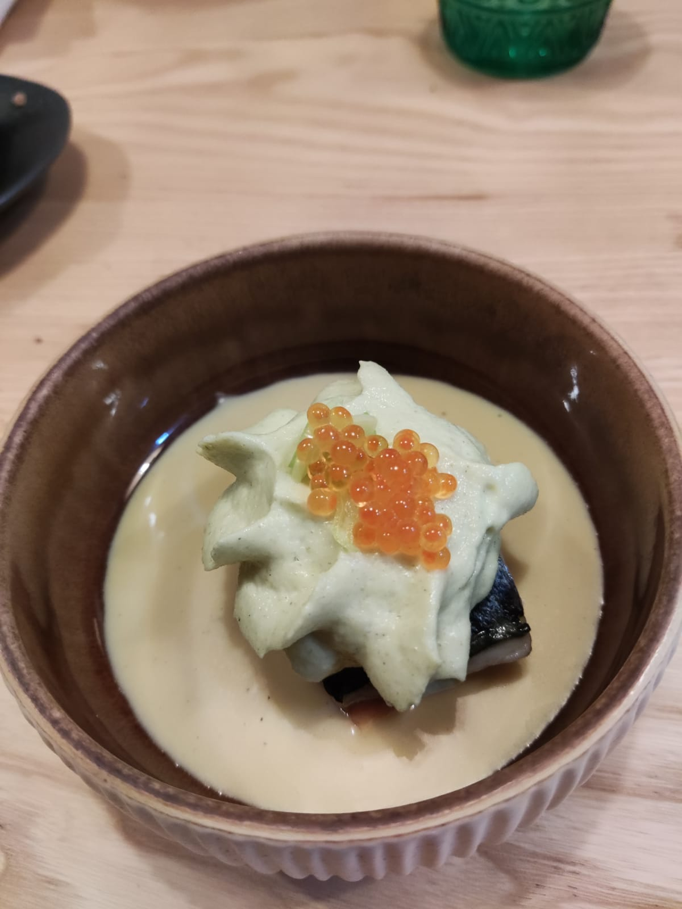

## 4º Plato

> Estaba bueno, pero no era magistral

> Francia: Breve recuerdo a la mantequilla ( coliflor, guiso de ajo, mantequilla, pescado lañado)
{: .prompt-tip }

Puntuacion guía ANDRADE FS: **8/10**
- Sabor en boca: 8/10
- Textura: 8/10 
- Regusto: 9/10

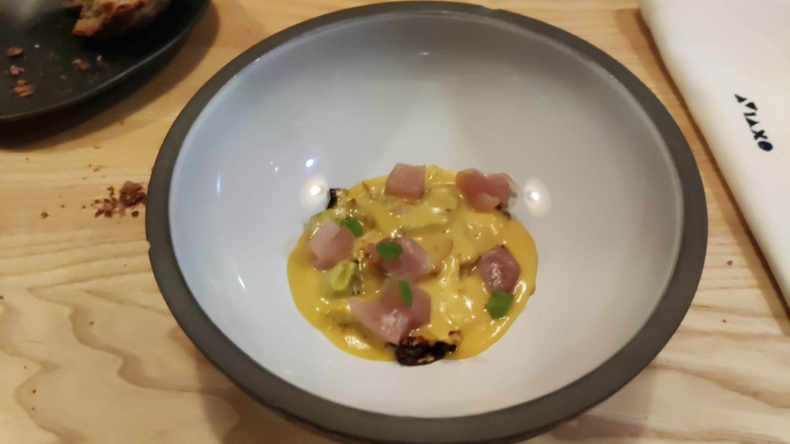

## 5º Plato

> Les encantó a todos menos a mi. Recordaba a comer callos con un regusto de ardo.

> Galicia: Jamon asado muy finito con pescado, un caldito y algo verde
{: .prompt-tip }

Puntuacion guía ANDRADE FS: **8/10**
- Sabor en boca: 7/10
- Textura: 7/10 
- Regusto: 9/10
  
> Recalquemos que nos echó el caldo en el plato y avisó de que quemaba, un detalle por el chef
{: .prompt-info }

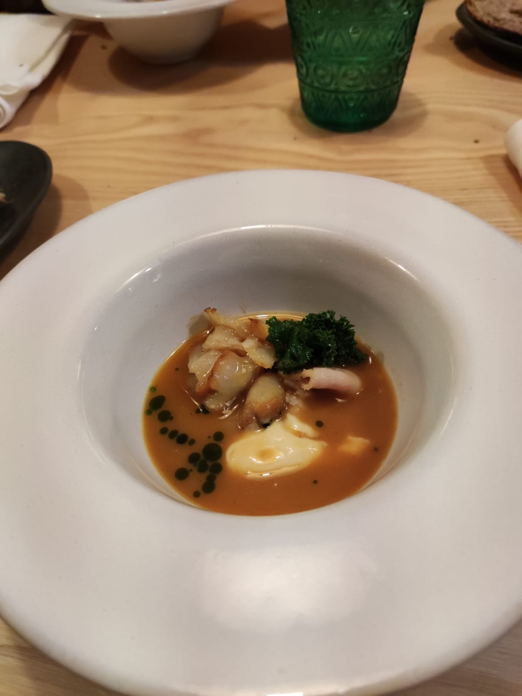

## 6º Plato

> Cebiche gallego

> ?? : Pulpo, gambas, maiz 
{: .prompt-tip }

Puntuacion guía ANDRADE FS: **10/10**
- Sabor en boca: 9/10
- Textura: 9/10 
- Regusto: 9/10
- BONUS POR CUBIERTO: 1/1

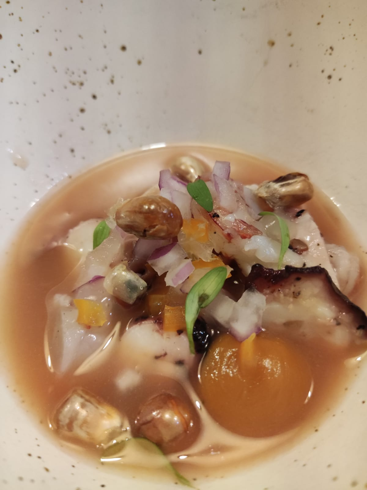
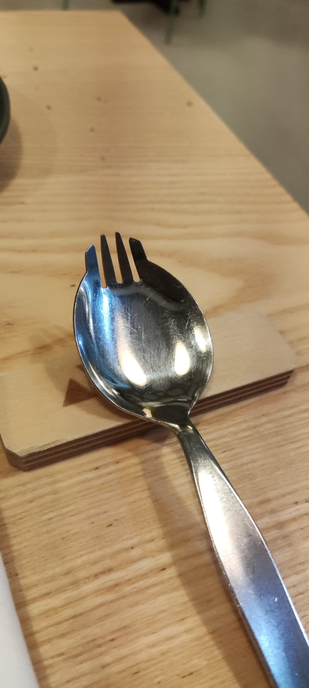

## 7º Plato

> Una desgracia, era el último salado, pero tocaba carne jejeje

> China : Jamon de cerdo de castañas, con una salsa dulce suave simila a recetas orientales, con un "pure" de castañas.
{: .prompt-tip }

Puntuacion guía ANDRADE FS: **9/10**
- Sabor en boca: 9/10
- Textura: 9/10 
- Regusto: 9/10

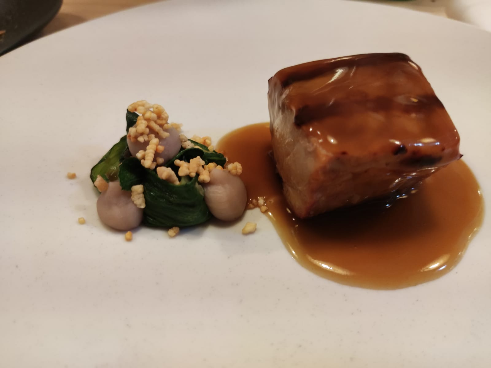

---

> Recalquemos que el pan, era un PAN, bien de miga, recordaba a la broa, pero sin una corteza tan dura.
{: .prompt-info }

----

# Postres

## 8º Plato

> Esto fue una sorpresa importante

> LATAM : Iogur con maracuyá y calabaza.
{: .prompt-tip }

Puntuacion guía ANDRADE FS: **10/10**
- Sabor en boca: 10/10
- Textura: 10/10 
- Regusto: 10/10

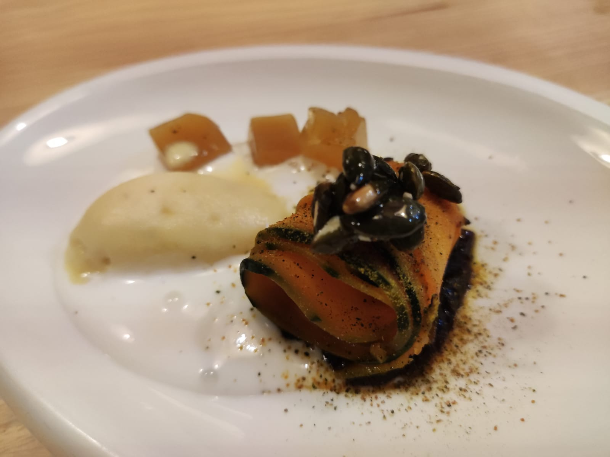

## 9º Plato

> Se sabía que era el último que nadia hablaba, solo disfrtuabamos del momento.

> Caribe : Chocolate picante, café  y galleta y aceite, si aceito con almidón.
{: .prompt-tip }

Puntuacion guía ANDRADE FS: **11/10**
- Sabor en boca: 10/10
- Textura: 10/10 
- Regusto: 10/10
- BONUS: 1/1

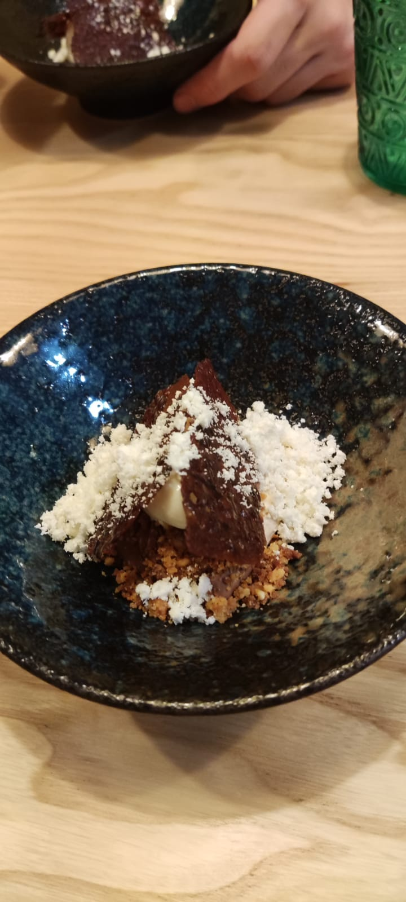

---

## BONUS:

> Sorpresa, empezamos con tentenpie, acabamos con uno tb.

> Nube citrica de una planta oriental plantada en galicia.
{: .prompt-tip }

Puntuacion guía ANDRADE FS: **9/10**
- Sabor en boca: 9/10
- Textura: 9/10 
- Regusto: 9/10

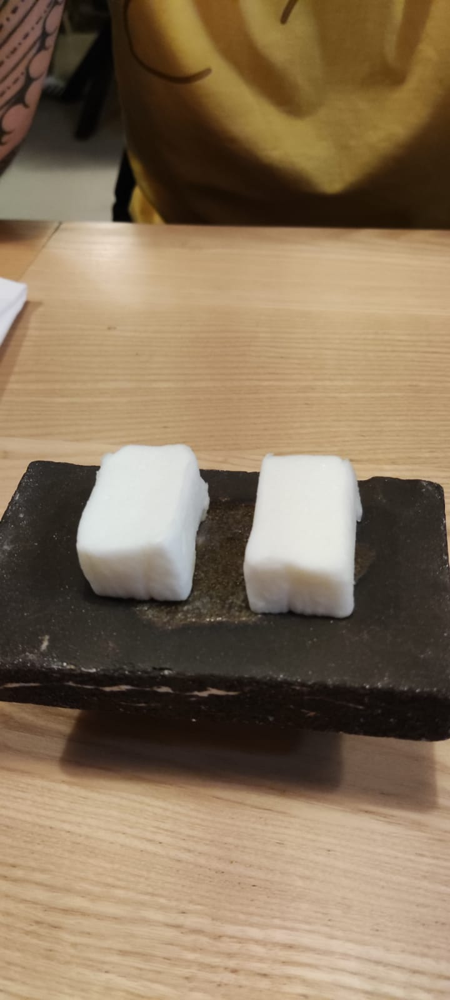
