The human factor is the weakest link in cybersecurity, we can have the best tools or analysts, but we are 2 clicks away from infecting an entire organization.

This is why it is highly recommended to create phishing campaigns to train teams in the detection and prevention of incidents, in this blog the idea is to understand how is the architecture of **Gophish** a tool to perform a simple way a phishing in your organization.

# GoPhish

We are going to create a scenario where we can use it easily in different occasions, for that we are going to have it orchestrated with docker, this will give us the flexibility we are looking for.

You can find all the code we are going to discuss here: [https://github.com/andrade-fs/GoPhish](https://github.com/andrade-fs/GoPhish)

## What is Gophish?

---

GoPhish is an open source tool used to perform phishing simulations on organizations.Some of the key features of GoPhish include:

- **Creation of fake emails and fake home pages:** GoPhish allows users to create realistic phishing emails and fake home pages that mimic legitimate websites to trick recipients.

- **Target segmentation:** You can define target groups within your organization and customize phishing campaigns for each group, allowing specific testing for different departments or teams.

- **User action tracking:** GoPhish tracks recipient actions such as opening emails, downloading attachments or entering information into fake forms, providing valuable data on the level of susceptibility and awareness of staff.

- **Detailed reporting:** Generates detailed reports on the success of campaigns, allowing you to evaluate the effectiveness of your security awareness and training efforts.

- **Integrations:** GoPhish can be integrated with other cybersecurity and incident management tools, making it easy to automate post-phishing detection actions.

>Es importante destacar que el uso de GoPhish debe estar en conformidad con las leyes y regulaciones locales y ser autorizado por la dirección de la organización.
{: .prompt-warning }

## Features
- [Docker](https://www.docker.com/)
- [Nginx](https://www.nginx.com/)
- [Let's Encrypt](https://letsencrypt.org/)
- [MySQL Database](https://www.mysql.com/)
- [phpMyAdmin database management UI](https://www.phpmyadmin.net/)
  
> Tested to launch on an Ubuntu 20.04 LTS Server

## Requirements
* For local setup, Get the right flavor of Docker for your OS...
    - [Docker for Mac](https://docs.docker.com/docker-for-mac/install/)
    - [Docker for Ubuntu](https://docs.docker.com/install/linux/docker-ce/ubuntu/)
    - [Docker for Windows](https://docs.docker.com/docker-for-windows/install/)

    **Note:** The recommended requirement for deployment of this project is 4 GB RAM.
    For Docker for Mac, this can be set by following these steps:

    Open Docker > Preferences > Advanced tab, then set memory to 4.0 GiB

* A registered domain name

## Architecture

---

The general architecture we will use is as follows:

├── etc  
│   ├── gophish  
│   │   ├── Dockerfile  
│   │   └── config.json  
│   ├── mysql  
│   │   ├── init.sql  
│   │   └── my.cnf  
│   ├── nginx  
│   │   ├── Dockerfile  
│   │   └── config.json  
│   └── env.dist  
├── Makefile  
├── docker-compose.yml  
└── init.sh  


### ``/etc/gophish``

---

Here we will have the configuration and those aspects that modify or change the configuration of gophish we will put them here.

- /etc/gophish/Dockerfile
  
  ```dockerfile
    FROM gophish/gophish:latest

    COPY config.json .

    CMD ["./gophish"]
  ```
- /etc/gophish/config.json  
  
  ```json
    {
        "admin_server": {
                "listen_url": "0.0.0.0:3333",
                "use_tls": false,
                "cert_path": "gophish_admin.crt",
                "key_path": "gophish_admin.key"
        },
        "phish_server": {
                "listen_url": "0.0.0.0:8080",
                "use_tls": false,
                "cert_path": "example.crt",
                "key_path": "example.key"
        },
        "db_name": "mysql",
        "db_path": "gophish:password@(mysql:3306)/gophish?charset=utf8&parseTime=True&loc=UTC", //-> CHANGE THIS PASSWD like the .env
        "migrations_prefix": "db/db_",
        "contact_address": "name@example.com",
        "logging": {
                "filename": "",
                "level": ""
        }
    }
  ```

>Remember to change this paswd "password" for your bd paswd of your .env
{: .prompt-info }

### ``/etc/mysql``

---

- /etc/mysql/init.sql

  ```sql
    ALTER DATABASE gophish CHARACTER SET utf8mb4 COLLATE utf8mb4_unicode_ci;
    GRANT ALL PRIVILEGES ON gophish.* TO gophish@'mysql' WITH GRANT OPTION;
    SET GLOBAL CONFIG
  ```
- /etc/mysql/my.cnf
  ```ini
    # The MySQL  Server configuration file.
    #
    # For explanations see
    # http://dev.mysql.com/doc/mysql/en/server-system-variables.html

    [mysqld]
    sql_mode        = ONLY_FULL_GROUP_BY,STRICT_TRANS_TABLES
    pid-file        = /var/run/mysqld/mysqld.pid
    socket          = /var/run/mysqld/mysqld.sock
    datadir         = /var/lib/mysql
    secure-file-priv= NULL
    # Disabling symbolic-links is recommended to prevent assorted security risks
    symbolic-links=0

    # Custom config should go here
    !includedir /etc/mysql/conf.d/
  ```
### ``/etc/nginx``

---

- /etc/nginx/Dockerfile

  ```dockerfile
    FROM nginx:latest
    RUN apt update

    RUN apt install -y \
        python3-acme \
        python3-certbot \
        python3-mock \
        python3-openssl \
        python3-pkg-resources \
        python3-pyparsing \
        python3-zope.interface

    RUN apt install python3-certbot-nginx

    RUN rm /etc/nginx/conf.d/default.conf

    COPY config.conf /etc/nginx/conf.d/

    CMD ["nginx", "-g", "daemon off;"]
  ```
- /etc/nginx/config.json  
  - Here we will configure the domains to use we will have 3 sections, one for domain.com we have 2 options create an index.html file in /var/www/index.html, or generate a redirect in the domain configuration (from your favorite client, ionos, goDaddy,...).
  - The second block will make the configuration for the phishing url, it will bind port 8080 to phising.domain.com, this is to improve the usability. 
    > Otherwise we could access domain:8080 anyway but it is not very credible.
  - The third block is to manage the dashboard, this is optional, since we will only enter if we have the campaign, but to have everything in order we will bind port 3333 to dashboard.domain.com.

  > When we have everything up we will be able to add ssl, in an automatic way later it will be detailed how.

  ```nginx
    server {
        listen 80;
        server_name domain.com;

        # Ruta al directorio donde se encuentra index.html
        root /var/www;

        # Servir index.html como archivo principal
        location / {
            try_files $uri $uri/ /index.html;
        }
    }

    server {
        listen 80;
        server_name phising.domain.com;

        location / {
            proxy_pass http://gophish:8080;
            proxy_set_header Host $host;
            proxy_set_header X-Real-IP $remote_addr;
            proxy_set_header X-Forwarded-For $proxy_add_x_forwarded_for;
            proxy_set_header X-Forwarded-Proto $scheme;
        }
    }

    server {
        listen 80;
        server_name dashboard.domain.com;

        location / {
            proxy_pass http://gophish:3333;
            proxy_set_header Host $host;
            proxy_set_header X-Real-IP $remote_addr;
            proxy_set_header X-Forwarded-For $proxy_add_x_forwarded_for;
            proxy_set_header X-Forwarded-Proto $scheme;
        }
    }
  ```

>Change **server_name** from domain.com to **your domain name**
{: .prompt-info }


### ``/etc/env.dist``

---

  - You can feel free to change these values but remember that the mysql password should be the same as the one you have in the gophish file seen above.
  
  > > Remember that when using docker if you modify these values once the build is done you will have to delete the image or in other words start again from 0 (delete containers, images, volumes, etc..).
  
  ```ini
    # Database
    MYSQL_DATABASE=gophish
    MYSQL_USER=gophish
    MYSQL_PASSWORD=password
    MYSQL_ROOT_PASSWORD=password

  ```

### ``docker-compose.yml``

---

  - Let's create a docker-compose that gathers the configuration from before and associates them to its services:
    - **Gophish**: Exposes ports `3333` and `8080`.
    - **nginx**: Exposes ports `80` and `443`.
    - **mysql**: Exposes ports `3306` and `8080`.
      - Additional volumes are configured for data persistence and configuration.
    - **phpmyadmin**: Exposes ports `8081`.
  - We are going to define a volume called `mysql_data` where we will have all the data persistence.
  - We define a default network `default` which is used to connect all the services defined in this `docker-compose` file.
  
> In the case of mysql, variables such as the root password are only applied the first time the container is started with an empty volume. If the volume already exists and has data, changing the root password in the .env will have no effect unless you also restart the volume or change the password manually inside the database.
{: .prompt-info }

```yaml
version: "3"

services:
  gophish:
    build:
      context: ./etc/gophish/
    container_name: gophish-prod
    restart: unless-stopped
    ports:
      - "3333:3333"
      - "8080:8080"
    depends_on:
      - mysql
    networks:
      - default
  nginx:
    build:
      context: ./etc/nginx/
    container_name: gophish-proxy
    restart: unless-stopped
    ports:
      - "80:80"
      - "443:443"
    networks:
      - default
  mysql:
    image: mysql:latest
    container_name: gophish-db
    restart: unless-stopped
    ports:
      - "3306:3306"
    volumes:
      - mysql_data:/var/lib/mysql
      - ./etc/mysql/:/docker-entrypoint-initdb.d/
      - ./etc/mysql/my.cnf:/etc/mysql/my.cnf
    networks:
      - default
    env_file:
      - .env
  phpmyadmin:
    image: phpmyadmin/phpmyadmin
    container_name: gophish_pma
    links:
      - mysql
    environment:
      PMA_HOST: mysql
      PMA_PORT: 3306
      PMA_ARBITRARY: 1
    restart: always
    ports:
      - 8081:80
volumes:
  mysql_data:

networks:
  default:
                  
```
### ``Makefile``

---

  - In order to favor this flexibility when orchestrating our services, we can add a Makefile in such a way that with only 2 commands we have everything up, computer...

```makefile
.PHONY: all help build logs loc up stop down

# make all - Default Target. Does nothing.
all:
	@echo "Helper commands."
	@echo "For more information try 'make help'."

# target: help - Display callable targets.
help:
	@egrep "^# target:" [Mm]akefile

init:
	sudo chmod u+x init.sh
	./init.sh

# target: build = build all containers
build:
	docker-compose build

# target: up - Run GoPhish.
up:
	 docker-compose up -d

# target: stop - Stop all docker containers
stop:
	docker-compose stop

# target: down - Remove all docker containers
down:
	docker-compose down
```

### ``init.sh``

- We can define a small generic script for the installation of the minimum requirements but this is optional as it will depend a lot on where it is used, access to firewall by cli, etc...

```bash
  #!/bin/bash

  # install latest version of docker the lazy way
  curl -sSL https://get.docker.com | sh

  # upgrade packages
  sudo apt update

  # make it so you don't need to sudo to run docker commands
  # note: make sure to log out and log in back in to reflect
  sudo groupadd docker
  sudo usermod -aG docker ubuntu


  # install docker and docker-compose
  sudo apt install docker-compose
  sudo apt install docker-ce
  sudo apt install make

  # remove the need for sudo
  sudo groupadd docker
  sudo gpasswd -a $USER docker

  # open firewall
  sudo ufw enable
  sudo ufw allow 80
  sudo ufw allow 443
  sudo ufw allow 'OpenSSH'
```

## Setup locally
- Create your env file
  ```bash
    cp .env.example .env
  ```
- Build containers
  ```bash
    make build
  ```
- Run GoPhish
   ```bash
    make up
  ```
- Restart proxy to reflect changes
  ```bash
    docker exec -it gophish-proxy service nginx restart
  ```
- GoPhish admin UI is running on `localhost` & `localhost:3333`
- Phishing server is running on `localhost:8080`
- Adminer UI is running on `localhost:9000`


### Stop and Remove project containers
- Stop all containers
    ```bash
    make stop
  ```
- Remove all containers
    ```bash
    make down
  ```

## Setup on a Production Server
- Create your env file in to the root directory
  ```bash
    cp .env.example .env
  ```
- Remind change the `server_name` in `etc/nginx/config.conf` from `domain.com` to **your domain name**
- Remind change the passw in `etc/gophish/config.json` from `password` to the same of the .env
- Update your `.env` file to a more secure database password
- Run **init.sh** ( or install requirements manually)
  ```bash
    make init
  ```
> Follow on-screen prompts and restart Server in order for changes to take effect

- Build containers
  ```bash
    make build
  ```
- Run GoPhish
   ```bash
    make up
  ```
### Generate SSL Certificates using Let's Encrypt
- Shell into the Nginx container:
  ```bash
    docker exec -it gophish-proxy bash
  ```
- Run Certbot:
  ```bash
    certbot --nginx
  ```
- Follow on-screen prompts
- Restart Nginx service
  ```bash
    service nginx restart
  ```
  > **Note:** the shell will close because this command restarts the container
- Restart the Nginx container
  ```bash
    make up
  ```
- Visit your domain to access the GoPhish admin UI

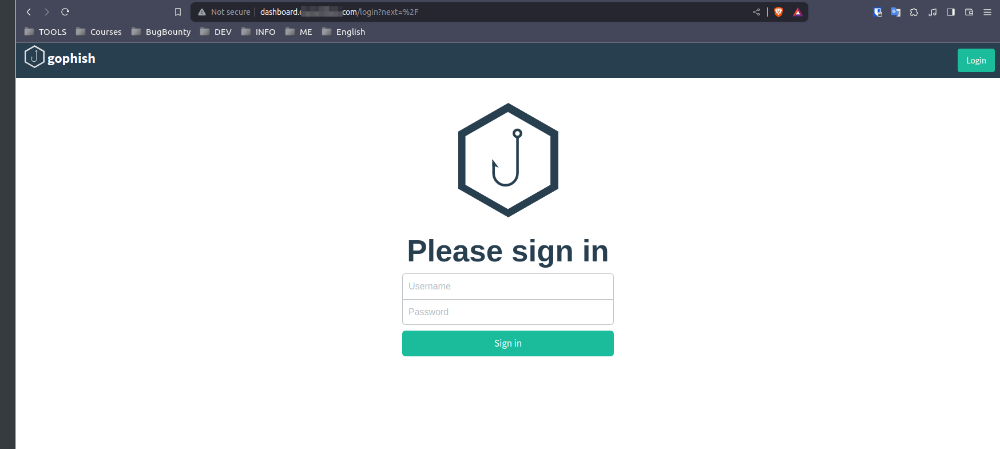

## Get init credentials

- Gophish generates a temporary password for when the service is first up, for this you can access the Gophish container and get the credentials:

```bash
docker logs gophish-prod | grep "password"
```

- If the above command does not work, search the logs for the password the output of ``docker logs gophish-prod`` will be similar to:

```wiki
 time="2020-06-30T08:04:33-05:00" level=warning msg="No contact address has been configured."
 time="2020-06-30T08:04:33-05:00" level=warning msg="Please consider adding a contact_address entry in your config.json"
 time="2020-06-30T08:04:33-05:00" level=info msg="Please login with the username admin and the password 1178f855283d03d3"
 time="2020-06-30T08:04:33-05:00" level=info msg="Starting phishing server at http://0.0.0.0:80"
 time="2020-06-30T08:04:33-05:00" level=info msg="Starting IMAP monitor manager"
 time="2020-06-30T08:04:33-05:00" level=info msg="Starting admin server at https://127.0.0.1:3333"
 time="2020-06-30T08:04:33-05:00" level=info msg="Background Worker Started Successfully - Waiting for Campaigns"
 time="2020-06-30T08:04:33-05:00" level=info msg="Starting new IMAP monitor for user admin"
```

## Set up gophish

This section is very customizable and personal, but to guide the process a little bit:
> This information is generic, just to illustrate the steps to follow. It must be replaced by your data.

### Sending Profiles
- We will need to have the smpt data of our email, this will be given to us by our provider.

- In gmail:
  - The first thing is to establish an application password, this will help us not to put our access password.
     - [https://myaccount.google.com/apppasswords](https://myaccount.google.com/apppasswords)
  
  > Es posible que necestes tener activo el 2FA

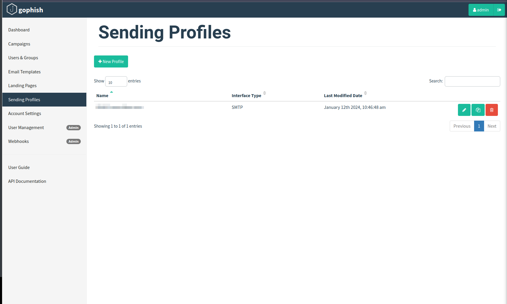


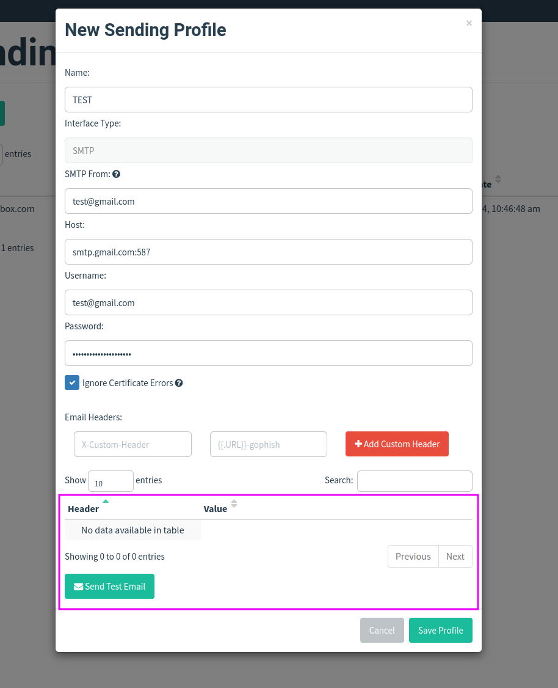

> You can send a test email to validate that the configuration is correct.
{: .prompt-info }

### Landing Page

- You can add the html code, but the best way to replicate an official website 100%, or at least the easiest way is to import a website, for that we will only need the url

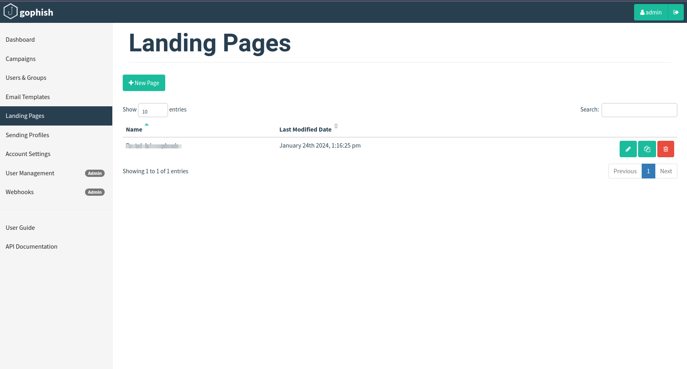

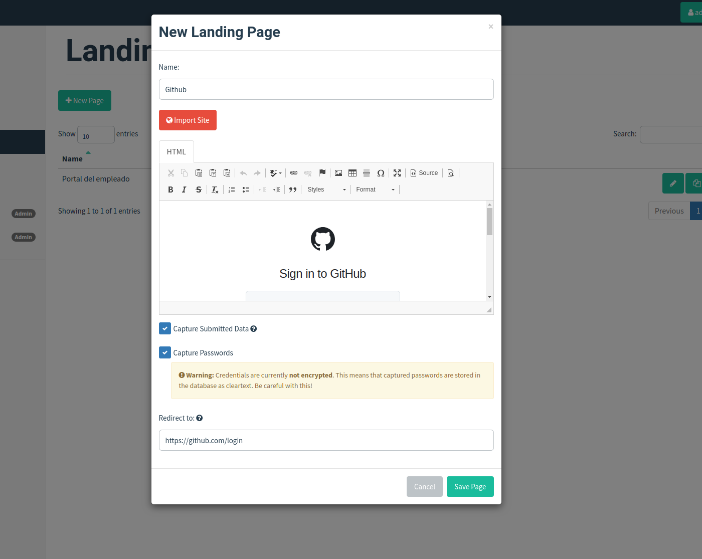

- We can store the form submissions and they will be stored and processed by gophish, we can choose to store the password (this will only be valid if the form is well developed and is categorized as a password).

- The redirect option is once our victim submits the form, it will be redirected to the official site, in this case github.com.
  
  > It is only one option, an interesting thing would be to be able to resend the data sent in such a way that the user does not see any change except the url, the flow was as expected, but given its complexity with a redirection would also work.

### Email Template

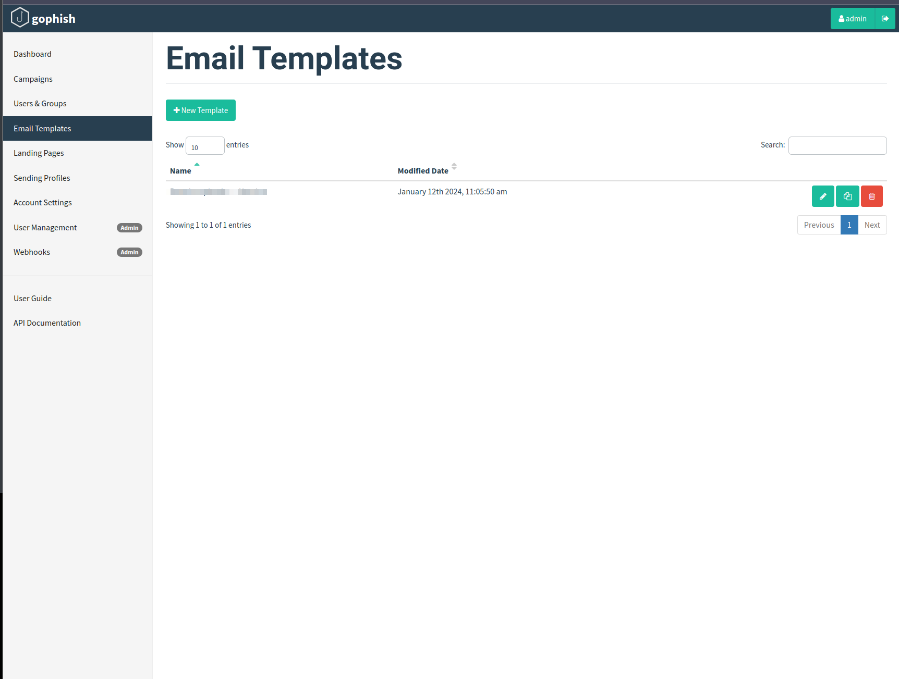

The best way to copy an email is to import an already known one, for this if it is a phishing on a known service we could know it, if not we could use reverse engineering techniques, such as sending communications to wait for a response and keep the format used, etc...

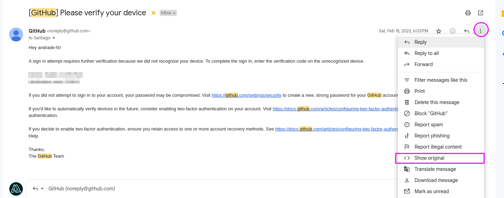

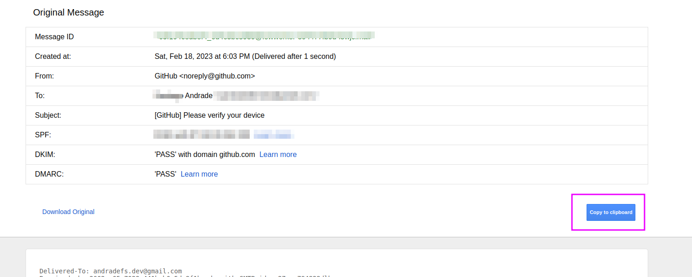

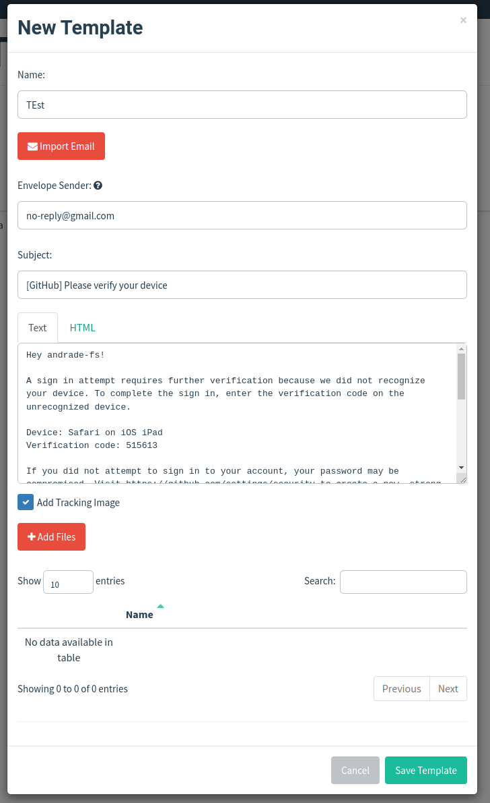

We can track an attachment: [https://docs.getgophish.com/user-guide/documentation/attachments](https://docs.getgophish.com/user-guide/documentation/attachments)


### Users & Groups

we can have more than 1 group on our campaigns. we can import it since a .csv with headers like this:


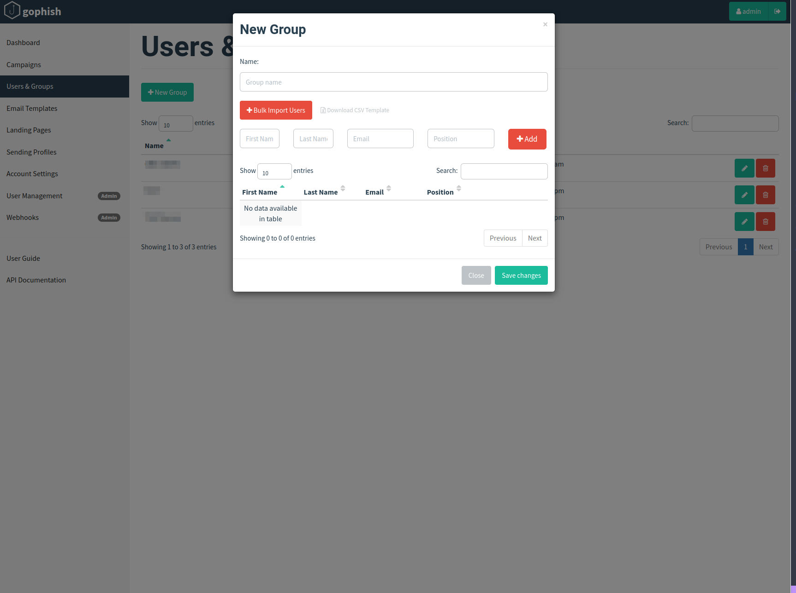

### Email Reporting
For more info check this: [https://docs.getgophish.com/user-guide/documentation/email-reporting](https://docs.getgophish.com/user-guide/documentation/email-reporting)
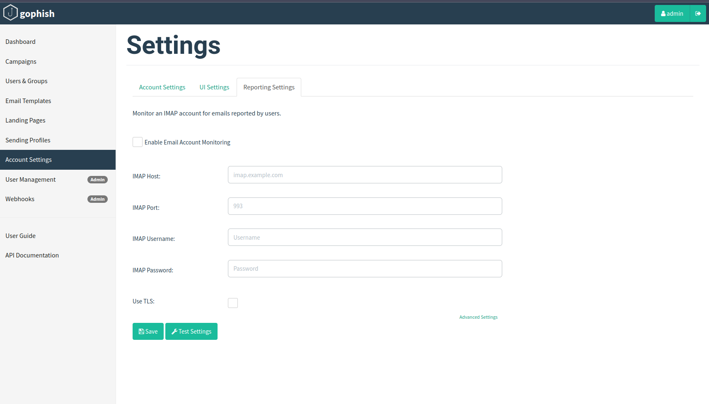


### Create Campaign

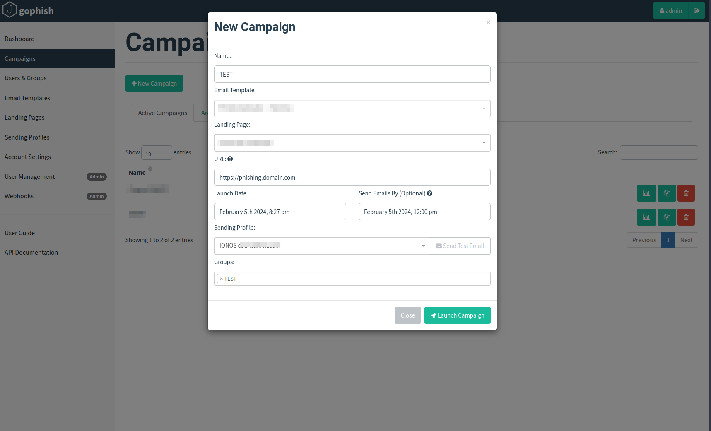

### Results

- Here you can see all the tests, export information to csv, etc.
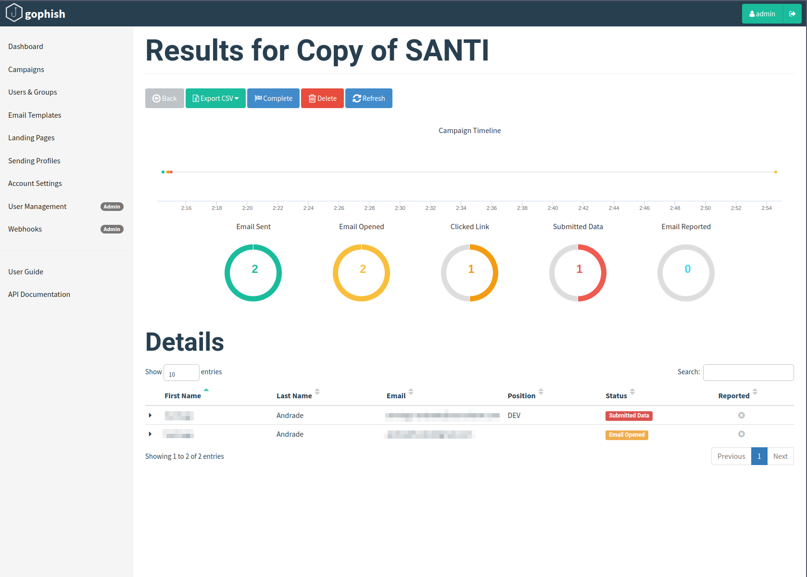


## Tips

---

- If the campaign is internal, the best way to avoid that the messages get to spam is to add the domain to the whitelist, in gmail it would be something similar to:

  - Log in to the Google Workspace Admin Console: you must be logged into your Google Workspace admin account.
 
  - Go to Apps > G Suite > Gmail: Navigate through the Admin Console until you get to the Gmail settings.
 
  - Select Email Settings: Here you will find options to manage email settings at the domain level.
 
  - Adjust spam settings: You can add email addresses or entire domains to the whitelist, which will cause emails from those senders not to be marked as spam for any user on your domain.

- Add the phishing page to [google search](https://search.google.com/search-console/about?hl=es), this tool will tell us if google is treating it as malicious, the reason, alternative solutions, if it is being indexed, etc...

- DMARC and DKIM configuration.


 Happy Hacking! 👨🏼‍💻

 Stay safe! 🛡️

🚀 Don’t forget to check out the 🚀 [Broker WriteUp](/posts/htb-broker) to improve your skills.
